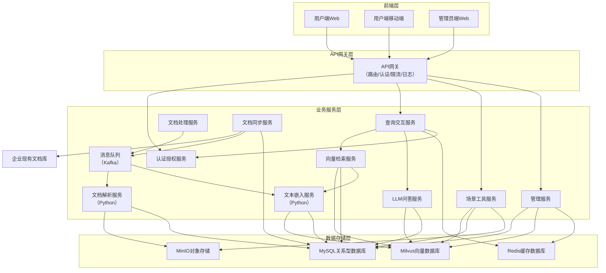
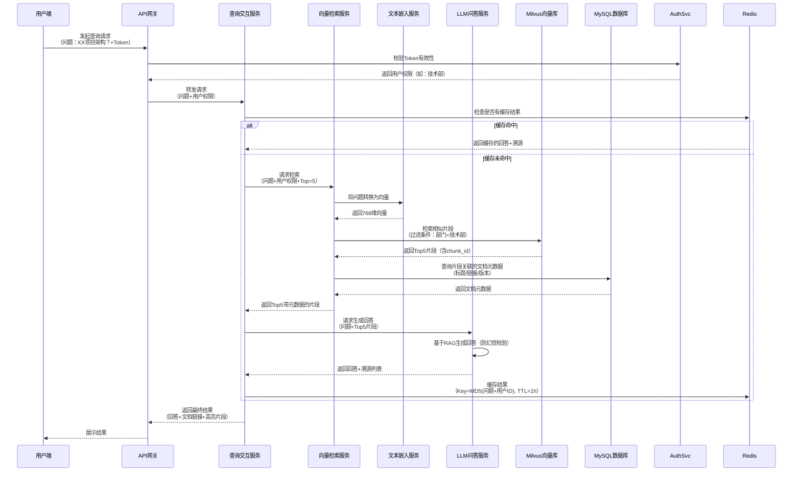

# 企业智能文档知识库助手 - 完整架构设计文档

**文档版本**：V1.0

**编制日期**：2025 年 11 月 11 日

**编制部门**：技术研发部

**适用范围**：开发团队、运维团队、技术管理层

## 一、文档基础信息

### 1.1 文档目的

明确系统从前端交互到后端服务、数据存储的全链路技术架构，定义核心模块功能、技术栈选型、数据模型、部署方案及安全策略，为开发落地提供技术蓝图，为运维提供部署维护依据，确保系统满足 “文档激活、精准检索、可信溯源” 的核心业务目标。

### 1.2 文档范围


* **包含内容**：架构分层设计、核心服务模块、数据存储模型、技术栈全景、部署架构、安全设计、性能优化、项目里程碑

* **排除内容**：具体 UI 设计稿、单元测试用例、业务需求说明书（需参考《企业智能文档知识库助手需求规格说明书 V1.0》）

### 1.3 目标受众


| 受众类型     | 核心关注点                        |
| -------- | ---------------------------- |
| 后端开发工程师  | 服务模块划分、接口定义、技术栈实现、数据交互流程     |
| 前端开发工程师  | 前端架构、交互逻辑、API 对接规范、权限控制逻辑    |
| AI 算法工程师 | 向量嵌入模型、LLM 调用流程、RAG 策略、防幻觉机制 |
| 运维工程师    | 部署架构、资源配置、监控告警、容灾方案、版本更新流程   |
| 技术管理层    | 架构合理性、技术风险、资源投入、项目进度、可扩展性    |

### 1.4 关键术语定义


| 术语   | 英文全称                           | 定义说明                                               |
| ---- | ------------------------------ | -------------------------------------------------- |
| RAG  | Retrieval-Augmented Generation | 检索增强生成，通过检索外部文档片段作为上下文，辅助 LLM 生成准确回答，避免模型幻觉        |
| 向量嵌入 | Vector Embedding               | 将文本、图像等非结构化数据转换为高维向量，通过向量相似度计算实现语义匹配               |
| 语义切片 | Semantic Chunking              | 按文本语义边界（而非固定字符数）分割文档，确保每个片段语义完整                    |
| 混合检索 | Hybrid Retrieval               | 结合向量语义检索（找 “意思相似”）与关键词检索（BM25 算法，找 “字词匹配”）的策略      |
| vLLM | Vectorized LLM                 | 向量化 LLM 推理框架，通过 PagedAttention 技术提升 LLM 吞吐量，降低推理延迟 |

## 二、系统架构总览

### 2.1 架构设计原则


1. **解耦微服务化**：按 “单一职责” 拆分服务，降低模块依赖，支持独立部署、扩展与迭代

2. **多语言协同**：Golang 负责高性能服务（网关、检索、同步），Python 负责 AI 相关处理（解析、嵌入、LLM）

3. **数据分层存储**：按数据类型（向量、结构化、文件、缓存）选择最优存储方案，平衡性能与成本

4. **异步化优先**：非实时任务（文档解析、嵌入）通过消息队列异步执行，避免阻塞主流程

5. **安全左移**：权限控制贯穿全链路，敏感数据加密存储，操作日志可追溯

6. **可扩展性设计**：服务支持水平扩展，存储支持分片 / 集群，模型支持动态切换

### 2.2 整体架构分层

采用 “四层微服务架构”，各层职责清晰、解耦彻底，架构图如下：




### 2.3 核心数据流

以 “用户查询文档” 为例，核心数据流如下：




## 三、各层级详细设计

### 3.1 前端层设计

#### 3.1.1 功能模块划分


| 端类型      | 核心模块    | 功能描述                                         |
| -------- | ------- | -------------------------------------------- |
| 用户端 Web  | 检索交互模块  | 自然语言输入、关键词筛选（文档类型 / 时间 / 部门）、查询历史、多轮对话上下文    |
|          | 结果展示模块  | 结构化回答展示、文档溯源（标题 + 链接 + 高亮片段）、相似度评分、片段展开 / 收起 |
|          | 场景工具模块  | 架构图查看 / 导出、文档摘要生成、术语词典查询、学习路径推荐              |
|          | 个人中心模块  | 权限查看、查询统计、反馈提交、个性化设置（如默认筛选条件）                |
| 用户端移动端   | 轻量化检索模块 | 简化版检索交互、结果展示，支持文档链接跳转（适配移动端文档查看）             |
|          | 消息通知模块  | 文档更新提醒、查询结果推送（如长文档解析完成）                      |
| 管理员端 Web | 知识库管理模块 | 文档质量审核、低质量文档标记（如 “过时”）、版本管理、批量操作             |
|          | 系统配置模块  | 模型参数配置（LLM 选型 / 检索 Top-K）、权限规则管理、缓存策略设置      |
|          | 监控面板模块  | 服务性能指标（响应时间 / 成功率）、检索日志分析、用户活跃度统计、异常告警       |
|          | 运维工具模块  | 文档重新解析、向量库重建、数据备份 / 恢复、系统版本更新                |

#### 3.1.2 技术栈选型


| 技术类别   | 选型                          | 选型理由                                             |
| ------ | --------------------------- | ------------------------------------------------ |
| 核心框架   | React 18 + TypeScript       | 组件化开发效率高，TypeScript 保障类型安全，适配企业级复杂应用             |
| UI 组件库 | Ant Design 5.x              | 提供丰富企业级组件（表格 / 表单 / 弹窗），支持主题定制，适配 Web / 移动端      |
| 状态管理   | Redux Toolkit + React Query | Redux 管理全局状态（如用户信息），React Query 管理接口请求缓存（减少重复请求） |
| 移动端适配  | Responsive Design + 媒体查询    | 一套代码适配 PC / 平板 / 手机，降低开发成本；关键页面（如文档查看）单独做移动端优化   |
| 构建工具   | Vite                        | 比 Webpack 热更新速度快 3 倍以上，支持按需编译，提升开发效率             |
| API 请求 | Axios + 拦截器                 | 统一请求 / 响应处理（如 Token 携带、错误拦截），支持请求重试 / 取消         |
| 图表可视化  | ECharts                     | 支持复杂图表（如用户活跃度折线图、检索成功率饼图），适配管理员监控面板              |

#### 3.1.3 前端架构设计

采用 “原子设计模式”，确保组件复用性与可维护性：


```
src/

├── assets/        # 静态资源（图片/样式/图标）

├── components/    # 组件库

│   ├── atoms/     # 原子组件（按钮/输入框/标签）

│   ├── molecules/ # 分子组件（检索框/结果卡片/溯源标签）

│   ├── organisms/ # 有机体组件（检索区域/结果列表/工具面板）

│   └── templates/ # 模板组件（页面框架/弹窗模板）

├── pages/         # 页面组件（对应路由）

│   ├── user/      # 用户端页面

│   ├── admin/     # 管理员端页面

│   └── common/    # 公共页面（登录/404）

├── services/      # API服务（按模块划分，如queryService.ts）

├── store/         # 状态管理（Redux切片/React Query配置）

├── utils/         # 工具函数（权限校验/格式转换/缓存处理）

└── routes/        # 路由配置（含权限路由守卫）
```

### 3.2 API 网关层设计

#### 3.2.1 核心功能


1. **路由转发**：按请求路径匹配后端服务（如`/api/query/*`转发至查询交互服务），支持动态路由配置

2. **认证授权**：校验用户 Token（JWT）有效性，无权限请求直接拦截并返回 403；支持白名单配置（如内部监控接口）

3. **限流熔断**：

* 限流策略：按用户维度（普通用户 10 次 / 分钟）、IP 维度（单 IP50 次 / 分钟）设置 QPS 上限

* 熔断策略：后端服务错误率 > 50% 时触发熔断，10 秒内直接返回降级响应（如 “服务临时不可用”）

1. **请求日志**：记录所有请求的 “请求路径、参数、用户 ID、IP、响应时间、状态码”，日志格式符合 ELK 采集规范

2. **协议转换**：支持 HTTP/HTTPS，未来可扩展 WebSocket（用于实时通知，如文档解析完成）

3. **请求校验**：对入参进行基础格式校验（如文档 ID 格式、查询文本长度），非法请求直接拦截

#### 3.2.2 技术栈选型


| 技术类别 | 选型                          | 选型理由                                         |
| ---- | --------------------------- | -------------------------------------------- |
| 开发语言 | Golang 1.21+                | 高性能（QPS 支持 10 万 +）、原生支持并发，适合网关这类高吞吐场景        |
| 核心框架 | Gin                         | 轻量级 HTTP 框架，路由性能优于 Beego/Echo，中间件生态丰富        |
| 认证组件 | JWT-Go                      | 轻量级 JWT 实现，支持自定义 Payload（如用户 ID / 权限 / 过期时间） |
| 限流组件 | Gin-Rate-Limiter + Redis    | 基于 Redis 实现分布式限流，支持多种限流算法（令牌桶 / 漏桶）          |
| 服务发现 | Kubernetes Service          | 生产环境依托 K8s 服务发现，无需额外部署 Consul；测试环境使用静态配置     |
| 日志组件 | Zap                         | 高性能日志库，支持结构化日志输出（JSON 格式），便于 ELK 分析          |
| 监控组件 | Prometheus + Gin-Prometheus | 暴露网关性能指标（请求量 / 响应时间 / 错误率），支持 Grafana 可视化    |

#### 3.2.3 中间件执行顺序


### 3.3 业务服务层设计

#### 3.3.1 认证授权服务（AuthSvc）


* **功能定位**：统一身份认证与权限管理，对接企业现有 SSO 系统

* **技术栈**：Golang + Casbin + Redis + gRPC

* **核心流程**：

1. 接收用户登录请求，转发至企业 SSO 系统（如 OAuth2.0 协议）

2. SSO 验证通过后，获取用户信息（ID / 部门 / 角色），生成 JWT Token（有效期 2 小时）

3. 基于 Casbin 实现 RBAC 权限模型，定义 “用户 - 角色 - 资源” 映射（如 “技术部开发 =》可访问技术文档库”）

4. Token 与用户权限缓存至 Redis，支持主动登出（删除 Redis 缓存）

5. 提供 gRPC 接口（`CheckPermission(userID, resource, action)`）供其他服务校验权限

* **关键代码示例（权限校验）**：


```golang
// 初始化Casbin权限模型
e, _ := casbin.NewEnforcer("rbac_model.conf", "rbac_policy.csv")

// 权限校验函数
func CheckPermission(userID string, resource string, action string) bool {
    // 示例：判断user1是否有权限访问doc_123文档
    return e.Enforce(userID, resource, action)
}

// gRPC接口实现
func (s *authService) CheckPermission(ctx context.Context, req *pb.CheckPermissionReq) (*pb.CheckPermissionResp, error) {
    hasPerm := CheckPermission(req.UserId, req.Resource, req.Action)
    return &pb.CheckPermissionResp{HasPermission: hasPerm}, nil
}
```

#### 3.3.2 查询交互服务（QuerySvc）


* **功能定位**：接收用户查询请求，协调检索、LLM 生成流程，管理缓存，返回最终结果

* **技术栈**：Golang + gRPC + Redis + Protobuf

* **核心流程**：

1. 接收 API 网关转发的查询请求（问题 + 用户 ID + 权限 + Top-K）

2. 生成缓存 Key（`query:{md5(问题+用户ID)}`），查询 Redis 缓存

3. 缓存命中：直接返回缓存的 “回答 + 溯源列表”

4. 缓存未命中：

* 调用向量检索服务，传入 “问题 + 用户权限 + Top-K”，获取带元数据的片段

* 调用 LLM 问答服务，传入 “问题 + Top-K 片段”，获取结构化回答

* 组装 “回答文本 + 溯源列表”，缓存至 Redis（TTL=1 小时）

1. 返回结果至 API 网关

* **性能优化**：


  * 批量请求合并：相同查询 1 秒内合并为 1 次调用，减少重复计算

  * 异步更新缓存：缓存过期后先返回旧数据，异步触发新检索更新缓存

  * 热点缓存：高频查询（如 “API 命名规范”）设置永久缓存，定期后台更新

#### 3.3.3 文档处理服务（DocProcessSvc）


* **功能定位**：接收文档同步消息，调度解析、切片、嵌入流程，更新文档处理状态

* **技术栈**：Python + Kafka + Celery + Protobuf

* **核心流程（异步流水线）**：


  ```mermaid
  sequenceDiagram
      participant SyncSvc as 文档同步服务
      participant MQ as Kafka消息队列
      participant DocProcessSvc as 文档处理服务
      participant ParserSvc as 文档解析服务
      participant EmbedSvc as 文本嵌入服务
      participant MinIO as MinIO存储
      participant VectorDB as Milvus向量库
      participant MySQL as MySQL数据库
      
      SyncSvc->>MQ: 发送文档处理消息<br>（doc_id+文件路径+类型+部门）
      MQ->>DocProcessSvc: 消费消息
      DocProcessSvc->>MySQL: 更新文档状态为“处理中”
      
      DocProcessSvc->>ParserSvc: 调用解析服务<br>（doc_id+文件路径+类型）
      ParserSvc->>MinIO: 读取原始文档
      ParserSvc->>ParserSvc: 格式解析（去水印/提取文本/表格）
      ParserSvc-->>DocProcessSvc: 返回纯文本+表格数据+处理状态
      alt 解析失败
          DocProcessSvc->>MySQL: 更新文档状态为“解析失败”
      else 解析成功
          DocProcessSvc->>DocProcessSvc: 语义切片（按句子边界，512字符/片）
          DocProcessSvc->>EmbedSvc: 调用嵌入服务<br>（doc_id+切片列表）
          EmbedSvc->>EmbedSvc: 文本嵌入（Sentence-BERT生成768维向量）
          EmbedSvc->>VectorDB: 写入向量+切片信息（chunk_id/doc_id/content）
          EmbedSvc-->>DocProcessSvc: 返回嵌入结果（成功/失败）
          
          alt 嵌入成功
              DocProcessSvc->>MySQL: 更新文档状态为“处理完成”
          else 嵌入失败
              DocProcessSvc->>MySQL: 更新文档状态为“嵌入失败”
          end
      end
  ```

* **关键技术**：


  * 语义切片：基于 Sentence-BERT 计算句子相似度，相似度 < 0.3 处切割，避免语义断裂

  * 失败重试：解析 / 嵌入失败时，通过 Celery 定时任务重试（最大 3 次，每次间隔 5 分钟）

  * 优先级调度：核心文档（如架构设计文档）设置高优先级，优先处理

#### 3.3.4 向量检索服务（VectorSearchSvc）


* **功能定位**：接收查询向量，返回符合用户权限的高相似度文档片段

* **技术栈**：Golang + Milvus SDK + gRPC + MySQL

* **核心流程**：

1. 接收查询交互服务请求（问题 + 用户权限 + Top-K）

2. 调用文本嵌入服务，将查询文本转换为 768 维向量

3. 构造 Milvus 检索条件：

* 向量字段：`embedding`

* 过滤条件：`department IN (用户权限部门) AND quality_score >= 60`（仅检索高质量文档）

* 索引类型：HNSW（M=16，ef=64，平衡速度与精度）

1. 执行检索，获取 Top-K 片段（含 chunk\_id、similarity）

2. 关联 MySQL 查询文档元数据（标题、链接、版本、上传时间）

3. 过滤相似度 < 60% 的结果，按相似度降序返回

* **性能优化**：


  * Milvus 分区：按 “部门 + 年份” 创建分区（如`tech_2024`），检索时仅扫描目标分区

  * 向量缓存：高频查询向量（如 “微服务架构”）缓存至 Redis，避免重复嵌入

  * 预计算：非工作时间预计算热门文档的向量索引，提升检索速度

#### 3.3.5 LLM 问答服务（LLMSvc）


* **功能定位**：基于检索到的文档片段生成可信回答，附加溯源信息，防止模型幻觉

* **技术栈**：Python + LangChain + vLLM + 私有 LLM 模型（如 Llama-2-70B）

* **核心流程**：

1. 接收查询交互服务请求（问题 + Top-K 片段列表）

2. 构建 RAG 提示词（强制约束模型行为）：


```
任务：基于以下文档片段回答用户问题，严格遵循规则：

1\. 仅使用片段中的信息，不编造内容；

2\. 若片段中无相关信息，直接返回“未找到足够答案”；

3\. 关键信息（如版本号、日期、组件名）需明确标注来源片段ID；

4\. 回答结构：先总述，再分点说明，最后附溯源列表。

文档片段：

{片段1：content + chunk\_id}

{片段2：content + chunk\_id}

用户问题：{问题}
```

1. 调用 vLLM 执行推理（比原生 PyTorch 吞吐量提升 10 倍 +）

2. 解析 LLM 输出，执行防幻觉校验：

* 关键信息比对：提取回答中的版本号、组件名，与片段原文匹配

* 置信度计算：基于 vLLM 返回的 token 概率，计算回答置信度（阈值 0.7）

1. 组装 “回答文本 + 溯源列表”（含文档标题、链接、高亮片段、相似度）

* **防幻觉机制**：


  * 提示词约束：明确禁止编造信息，强制标注来源

  * 事实校验：关键信息不匹配时，标注 “待验证” 并附上原文链接

  * 低置信度拒答：置信度 <0.7 时，返回 “回答可信度较低，建议参考原始文档”

#### 3.3.6 其他服务简述


| 服务名称   | 功能定位                     | 技术栈                                      | 核心特点                                              |
| ------ | ------------------------ | ---------------------------------------- | ------------------------------------------------- |
| 场景工具服务 | 提供架构图梳理、文档摘要、术语词典功能      | Python + Graphviz + Pandas + python-docx | 架构图支持导出 PNG/PDF；摘要按 “技术难点 / 解决方案” 分类；术语词典自动关联来源文档 |
| 文档同步服务 | 对接企业现有文档库，实时同步新文档 / 更新文档 | Golang + 企业文档库 API（如 SharePoint API）     | 支持增量同步（基于文件哈希）；失败重试（最大 3 次）；同步日志记录至 MySQL         |
| 管理服务   | 提供管理员端功能支持（配置、监控、审核）     | Golang + GORM（MySQL ORM） + Gin           | 配置变更实时生效（无需重启服务）；支持批量操作（如批量标记低质量文档）               |

### 3.4 数据存储层设计

#### 3.4.1 存储选型总览


| 存储系统      | 用途                        | 选型理由                                            | 扩展策略                                      |
| --------- | ------------------------- | ----------------------------------------------- | ----------------------------------------- |
| Milvus    | 存储文档片段向量与关联信息             | 分布式向量数据库，支持亿级数据存储；HNSW 索引查询延迟 < 100ms；支持分区 / 分片 | 按 “部门 + 年份” 分片，新增查询节点提升并发                 |
| MySQL 8.0 | 存储文档元数据、用户信息、权限规则、系统配置    | 成熟稳定，支持事务；InnoDB 引擎支持行级锁，适合高频更新；分表策略灵活          | 文档表按年份分表（如`documents_2023`）；读写分离（1 主 2 从） |
| MinIO     | 存储原始文档、解析后的结构化文件（表格 / 图表） | 兼容 S3 协议，支持分布式部署；支持对象生命周期管理（旧文档归档）；访问控制精细       | 按 “部门 / 年份” 划分 Bucket；分布式部署（4 节点，3 副本）    |
| Redis 7.0 | 缓存高频查询结果、用户会话、系统配置、限流计数   | 高性能内存数据库，支持多种数据结构；主从架构保障高可用；支持 Lua 脚本           | 主从架构 + 哨兵模式（1 主 2 从 1 哨兵）；缓存淘汰策略：LRU      |

#### 3.4.2 核心数据模型

##### （1）Milvus 向量集合：`document_chunks`


| 字段名            | 字段类型             | 描述                                                          | 索引配置                              |
| -------------- | ---------------- | ----------------------------------------------------------- | --------------------------------- |
| chunk\_id      | String           | 片段唯一 ID（UUID，如`chunk_123e4567-e89b-12d3-a456-426614174000`） | 主键索引（Primary Key）                 |
| doc\_id        | String           | 关联文档 ID（与 MySQL`documents`表`doc_id`关联）                      | 分区键（Partition Key），按 “部门 + 年份” 分区 |
| embedding      | FloatVector(768) | 文本嵌入向量（Sentence-BERT 生成）                                    | HNSW 索引（M=16，efConstruction=200）  |
| content        | String           | 片段文本内容（最大 512 字符）                                           | 全文索引（FULLTEXT INDEX），支持关键词检索      |
| department     | String           | 所属部门（如 “技术部”“产品部”）                                          | 过滤索引（Filter Index）                |
| quality\_score | Int8             | 片段质量评分（0-100，基于文本清晰度、完整性计算）                                 | 过滤索引                              |
| create\_time   | Int64            | 创建时间（毫秒级时间戳）                                                | 排序索引（Sort Index）                  |

##### （2）MySQL 核心表结构

###### ① `documents`（文档元数据表）


| 字段名              | 类型           | 约束          | 描述                                               |
| ---------------- | ------------ | ----------- | ------------------------------------------------ |
| doc\_id          | VARCHAR(64)  | PRIMARY KEY | 文档唯一 ID（UUID）                                    |
| title            | VARCHAR(255) | NOT NULL    | 文档标题（如 “2024 年 XX 项目微服务架构设计文档”）                  |
| file\_path       | VARCHAR(512) | NOT NULL    | MinIO 存储路径（如`/tech/2024/xx_architecture.pdf`）    |
| file\_type       | VARCHAR(32)  | NOT NULL    | 文档类型（pdf/docx/md/ppt/excel）                      |
| file\_size       | BIGINT       | NOT NULL    | 文档大小（字节）                                         |
| version          | VARCHAR(16)  | NOT NULL    | 文档版本（如 “V1.0”“V2.1”）                             |
| author\_id       | VARCHAR(64)  | NOT NULL    | 上传者 ID（关联`users`表`user_id`）                      |
| department       | VARCHAR(32)  | NOT NULL    | 所属部门                                             |
| upload\_time     | DATETIME     | NOT NULL    | 上传时间（如 “2024-10-01 14:30:00”）                    |
| process\_status  | TINYINT      | NOT NULL    | 处理状态（0 = 待处理，1 = 处理中，2 = 处理完成，3 = 解析失败，4 = 嵌入失败） |
| quality\_score   | TINYINT      | DEFAULT 80  | 文档质量评分（0-100，人工审核 + AI 自动评分）                     |
| is\_valid        | TINYINT      | DEFAULT 1   | 是否有效（1 = 有效，0 = 已废弃 / 删除）                        |
| last\_sync\_time | DATETIME     | NULL        | 最后同步时间（从企业文档库同步的时间）                              |
| description      | TEXT         | NULL        | 文档描述（可选）                                         |

###### ② `users`（用户表）


| 字段名                | 类型           | 约束          | 描述                                       |
| ------------------ | ------------ | ----------- | ---------------------------------------- |
| user\_id           | VARCHAR(64)  | PRIMARY KEY | 用户唯一 ID（与企业 SSO 系统用户 ID 一致）              |
| username           | VARCHAR(64)  | NOT NULL    | 用户名                                      |
| email              | VARCHAR(128) | UNIQUE      | 用户邮箱（用于通知）                               |
| department         | VARCHAR(32)  | NOT NULL    | 所属部门                                     |
| role               | VARCHAR(32)  | NOT NULL    | 用户角色（admin = 管理员，user = 普通用户，guest = 访客） |
| sso\_token         | VARCHAR(256) | NULL        | SSO 令牌（缓存，减少 SSO 调用次数）                   |
| sso\_token\_expire | DATETIME     | NULL        | SSO 令牌过期时间                               |
| create\_time       | DATETIME     | NOT NULL    | 创建时间                                     |
| last\_login\_time  | DATETIME     | NULL        | 最后登录时间                                   |
| status             | TINYINT      | DEFAULT 1   | 账号状态（1 = 正常，0 = 禁用）                      |

###### ③ `permissions`（权限表）


| 字段名            | 类型          | 约束                          | 描述                                                |
| -------------- | ----------- | --------------------------- | ------------------------------------------------- |
| perm\_id       | INT         | PRIMARY KEY AUTO\_INCREMENT | 权限 ID                                             |
| role           | VARCHAR(32) | NOT NULL                    | 角色（与`users`表`role`关联）                             |
| resource\_type | VARCHAR(32) | NOT NULL                    | 资源类型（document = 文档，config = 系统配置，monitor = 监控数据）  |
| resource\_id   | VARCHAR(64) | NULL                        | 资源 ID（如文档 ID，NULL 表示所有该类型资源）                      |
| action         | VARCHAR(32) | NOT NULL                    | 操作（read = 读取，write = 修改，delete = 删除，approve = 审核） |
| create\_time   | DATETIME    | NOT NULL                    | 创建时间                                              |
| is\_valid      | TINYINT     | DEFAULT 1                   | 是否有效（1 = 有效，0 = 无效）                               |

##### （3）Redis 关键缓存 Key 设计


| Key 格式                       | 数据类型   | 过期时间     | 描述                                                               |
| ---------------------------- | ------ | -------- | ---------------------------------------------------------------- |
| `query:{md5(query+user_id)}` | String | 1 小时     | 高频查询结果缓存（存储 JSON 格式的 “回答 + 溯源列表”）                                |
| `user:token:{token}`         | Hash   | 2 小时     | 用户会话缓存（字段：user\_id、username、department、role）                     |
| `config:{config_key}`        | String | 永久（手动更新） | 系统配置缓存（如`config:llm_model`=“llama-2-70b”，`config:search_topk`=5） |
| `rate_limit:{user_id}`       | String | 1 分钟     | 限流计数（存储用户 1 分钟内请求次数，如 “12”）                                      |
| `embedding:{md5(text)}`      | String | 7 天      | 文本嵌入缓存（存储 Base64 编码的 768 维向量）                                    |
| `doc_status:{doc_id}`        | String | 24 小时    | 文档处理状态缓存（如 “处理中”“处理完成”）                                          |

## 四、技术栈全景图


| 架构层级    | 模块 / 组件        | 开发语言       | 核心技术 / 框架                                | 辅助工具                                   |
| ------- | -------------- | ---------- | ---------------------------------------- | -------------------------------------- |
| 前端层     | 用户端 / 管理员端 Web | TypeScript | React 18、Ant Design 5.x、Redux Toolkit    | Vite、ECharts、React-PDF                 |
|         | 用户端移动端         | TypeScript | React + 媒体查询、Axios                       | Vite、PostCSS（适配）                       |
| API 网关层 | API 网关         | Golang     | Gin、JWT-Go、Gin-Rate-Limiter              | Zap（日志）、Prometheus-Gin-Exporter        |
| 业务服务层   | 认证授权服务         | Golang     | Casbin、Redis、gRPC                        | Protobuf（接口定义）                         |
|         | 查询交互服务         | Golang     | gRPC、Redis、GORM                          | Protobuf                               |
|         | 文档处理服务         | Python     | Kafka、Celery、LangChain                   | Redis（Celery Broker）                   |
|         | 文档解析服务         | Python     | Apache Tika、PaddleOCR、python-docx        | Pillow（图片处理）                           |
|         | 文本嵌入服务         | Python     | Sentence-BERT、PyTorch                    | Hugging Face Transformers              |
|         | 向量检索服务         | Golang     | Milvus SDK、gRPC、MySQL                    | Protobuf                               |
|         | LLM 问答服务       | Python     | LangChain、vLLM、私有 LLM 模型（Llama-2-70B）    | PyTorch、CUDA（GPU 加速）                   |
|         | 场景工具服务         | Python     | Graphviz、Pandas、python-docx              | Matplotlib（图表）                         |
|         | 文档同步服务         | Golang     | 企业文档库 API（如 SharePoint API）、Kafka        | -                                      |
|         | 管理服务           | Golang     | Gin、GORM、Redis                           | -                                      |
|         | 消息队列           | -          | Kafka 3.x                                | Kafka-Manager（监控）                      |
| 数据存储层   | 向量数据库          | -          | Milvus 2.3.x                             | Milvus Console（管理）                     |
|         | 关系型数据库         | -          | MySQL 8.0（InnoDB）                        | Navicat、Prometheus-MySQL-Exporter      |
|         | 对象存储           | -          | MinIO（分布式）                               | MinIO Console、mc（命令行工具）                |
|         | 缓存数据库          | -          | Redis 7.0                                | RedisInsight、Prometheus-Redis-Exporter |
| 部署运维    | 容器化            | -          | Docker、Kubernetes 1.28+                  | Helm（包管理）、Istio（服务网格）                  |
|         | 监控告警           | -          | Prometheus、Grafana、AlertManager          | Node Exporter、Kube State Metrics       |
|         | 日志管理           | -          | ELK Stack（Elasticsearch、Logstash、Kibana） | Filebeat（日志采集）                         |
|         | CI/CD          | -          | GitLab CI、Jenkins                        | Docker Buildx（镜像构建）                    |

## 五、部署架构设计

### 5.1 环境划分


| 环境   | 用途        | 部署规模                 | 核心配置差异                                                      |
| ---- | --------- | -------------------- | ----------------------------------------------------------- |
| 开发环境 | 开发调试、单元测试 | 单机部署（Docker Compose） | 所有服务单容器，存储使用单节点（Milvus/MySQL/MinIO）；LLM 使用轻量模型（Llama-2-7B）  |
| 测试环境 | 功能测试、性能测试 | 小型 K8s 集群（3 节点）      | 核心服务 2 副本，存储使用小型集群（Milvus 1 主 1 从，MySQL 1 主 1 从）；LLM 使用标准模型 |
| 生产环境 | 线上服务      | 中型 K8s 集群（6 节点）      | 核心服务 3 + 副本，存储使用高可用集群；LLM 使用 GPU 节点部署；开启 Istio 服务网格         |

### 5.2 生产环境 K8s 集群规划

#### 5.2.1 节点资源配置


| 节点角色        | 数量 | 硬件配置（CPU / 内存 / GPU / 磁盘）   | 负责服务 / 组件                                   | 备注                            |
| ----------- | -- | --------------------------- | ------------------------------------------- | ----------------------------- |
| K8s 控制节点    | 1  | 8C/16G / 无 / 100G SSD       | K8s Control Plane（apiserver、etcd、scheduler） | 单独部署，避免资源竞争                   |
| 计算节点（核心服务）  | 3  | 16C/64G / 无 / 500G SSD      | API 网关、查询交互服务、向量检索服务、认证服务                   | 高内存配置，支持向量检索缓存                |
| 计算节点（AI 服务） | 1  | 32C/128G/V100×2/1T SSD      | LLM 问答服务、文本嵌入服务                             | GPU 加速 LLM 推理与向量嵌入            |
| 计算节点（辅助服务）  | 1  | 8C/16G / 无 / 200G SSD       | 文档处理服务、文档同步服务、管理服务                          | 低资源需求，可与监控组件共享节点              |
| 存储节点        | 1  | 16C/64G / 无 / 4T SSD（RAID5） | Milvus、MySQL、MinIO、Redis                    | 高 IOPS 磁盘，保障存储性能；RAID5 确保数据安全 |

#### 5.2.2 服务部署策略


| 服务类型     | K8s 资源类型    | 副本数             | 资源限制（CPU / 内存） | 调度策略                                | 健康检查配置                                    |
| -------- | ----------- | --------------- | -------------- | ----------------------------------- | ----------------------------------------- |
| API 网关   | Deployment  | 3               | 2C/4G          | 调度至核心服务节点                           | livenessProbe：/health/live（间隔 10s，超时 3s）  |
| 查询交互服务   | Deployment  | 3               | 4C/8G          | 调度至核心服务节点                           | livenessProbe：/health/live（间隔 10s，超时 3s）  |
| 向量检索服务   | Deployment  | 3               | 4C/16G         | 调度至核心服务节点（高内存）                      | livenessProbe：/health/live（间隔 10s，超时 3s）  |
| LLM 问答服务 | Deployment  | 2               | 16C/64G（GPU:1） | 调度至 AI 服务节点（nodeSelector: gpu=true） | livenessProbe：/health/live（间隔 30s，超时 10s） |
| 文档处理服务   | Deployment  | 2               | 2C/4G          | 调度至辅助服务节点                           | livenessProbe：/health/live（间隔 15s，超时 5s）  |
| Milvus   | StatefulSet | 3（1 主 2 从）      | 8C/32G         | 调度至存储节点                             | livenessProbe：Milvus 健康检查接口（间隔 20s）       |
| MySQL    | StatefulSet | 2（1 主 1 从）      | 4C/16G         | 调度至存储节点                             | livenessProbe：mysqladmin ping（间隔 10s）     |
| MinIO    | StatefulSet | 4（分布式）          | 2C/8G          | 调度至存储节点                             | livenessProbe：MinIO 健康检查接口（间隔 10s）        |
| Redis    | StatefulSet | 3（1 主 2 从 1 哨兵） | 2C/4G          | 调度至存储节点                             | livenessProbe：redis-cli ping（间隔 5s）       |

#### 5.2.3 网络与存储配置

##### （1）网络配置


* **服务网格**：部署 Istio 1.18+，实现：


  * 服务间通信 TLS 加密（避免数据泄露）

  * 流量控制（如 LLM 服务仅允许查询交互服务调用）

  * 灰度发布（支持按用户比例路由新版本服务）

* **Ingress**：使用 Nginx Ingress Controller，对外暴露：


  * 前端服务：`doc-ai.example.com`（用户端）、`admin.doc-ai.example.com`（管理员端）

  * API 网关：`api.doc-ai.example.com`

* **网络策略**：配置 K8s NetworkPolicy，限制服务间访问（如仅 API 网关可访问后端服务）

##### （2）存储配置


* **Milvus 存储**：


  * 元数据存储：使用 MySQL（与业务元数据共享）

  * 向量数据存储：使用 MinIO（分布式存储，3 副本）

  * 索引存储：使用本地 SSD（存储节点本地磁盘，提升索引读取速度）

* **MySQL 存储**：


  * 数据目录：挂载 PV（使用 Rook-Ceph 分布式存储，3 副本）

  * 备份策略：每日全量备份 + 增量备份，备份文件存储至 MinIO 归档

* **MinIO 存储**：


  * 部署模式：分布式 4 节点，数据 3 副本

  * Bucket 策略：按 “部门 + 年份” 创建 Bucket，设置访问权限（如`tech-2024`仅技术部可访问）

  * 生命周期管理：3 年以上文档自动归档至冷存储（如 S3 兼容的对象存储）

* **Redis 存储**：


  * 数据持久化：开启 RDB+AOF 混合模式（RDB 每小时，AOF 每秒）

  * 缓存淘汰：内存达到 80% 时，按 LRU 策略淘汰过期缓存

### 5.3 部署流程（生产环境）


1. **环境准备**：

* 部署 K8s 集群（6 节点），安装 Istio、Rook-Ceph、Nginx Ingress

* 配置域名解析（将前端 / API 域名指向 Ingress IP）

* 准备 GPU 节点（安装 CUDA 12.0+、NVIDIA Docker Runtime）

1. **存储部署**：

* 使用 Helm 部署 Milvus：`helm install milvus milvus/milvus -f milvus-values.yaml`

* 部署 MySQL：`helm install mysql bitnami/mysql -f mysql-values.yaml`（开启主从）

* 部署 MinIO：`helm install minio minio/minio -f minio-values.yaml`（分布式 4 节点）

* 部署 Redis：`helm install redis bitnami/redis -f redis-values.yaml`（主从 + 哨兵）

1. **后端服务部署**：

* 部署 Kafka：`helm install kafka bitnami/kafka -f kafka-values.yaml`

* 按依赖顺序部署服务：认证授权服务 → 文档同步服务 → 文档处理服务 → 向量检索服务 → LLM 问答服务 → 查询交互服务 → 场景工具服务 → 管理服务

* 部署 API 网关：配置路由规则、限流策略、认证参数

1. **前端部署**：

* 构建前端镜像：`docker build -t doc-ai-frontend:v1.0 .`

* 部署前端服务：`kubectl apply -f frontend-deployment.yaml`

* 配置 Ingress：关联前端域名与服务

1. **初始化配置**：

* 初始化 MySQL 数据库（创建表结构、导入初始权限数据）

* 初始化 Milvus 集合（创建`document_chunks`集合及索引）

* 配置系统参数（LLM 模型选型、检索 Top-K、限流阈值）

* 对接企业 SSO 系统（配置 OAuth2.0 参数）

1. **测试验证**：

* 功能测试：验证文档同步、解析、检索、问答全流程

* 性能测试：使用 JMeter 模拟 1000 并发用户，验证响应时间与成功率

* 安全测试：验证权限控制、数据加密、接口防护有效性

## 六、安全设计

### 6.1 身份认证与授权


1. **统一身份认证**：

* 对接企业现有 SSO 系统（支持 OAuth2.0/OIDC 协议），避免重复登录

* 支持多因素认证（MFA）：管理员登录需额外验证手机验证码

* Token 管理：JWT Token 有效期 2 小时，支持主动登出（删除 Redis 缓存）；定期刷新 Token（前端每 30 分钟请求刷新）

1. **细粒度权限控制**：

* 基于 RBAC 模型：用户→角色→权限，支持自定义角色（如 “技术部只读角色”“文档审核角色”）

* 资源级权限：


  * 文档权限：按部门 / 项目组划分访问范围（如技术部用户仅能访问技术文档）

  * 操作权限：普通用户仅能 “查询 / 查看”，管理员可 “审核 / 配置 / 删除”

* 动态权限校验：所有服务调用前通过认证授权服务校验权限（如向量检索前校验文档访问权限）

### 6.2 数据安全


1. **传输安全**：

* 前端→API 网关：使用 HTTPS（TLS 1.3），配置 HSTS（强制 HTTPS）

* 服务间通信：使用 gRPC+TLS 加密，Istio 服务网格确保 Pod 间通信加密

* 存储访问：Milvus/MySQL/MinIO 访问均使用 TLS 加密，避免数据在传输中泄露

1. **存储安全**：

* 敏感数据加密：


  * 用户密码：使用 BCrypt 算法加盐哈希存储（不存储明文）

  * 文档敏感信息：自动识别手机号、邮箱、身份证号，脱敏后存储（如 “138\*\*\*\*1234”）

  * 配置文件：系统敏感配置（如数据库密码、API 密钥）使用 K8s Secret 存储，加密挂载

* 数据备份：


  * MySQL：每日全量备份 + 增量备份，备份文件加密存储至 MinIO，保留 30 天

  * Milvus：定期备份向量数据，支持按时间点恢复

  * 灾备策略：跨可用区部署存储组件（如 MySQL 主从跨 AZ），确保单点故障不丢失数据

1. **数据销毁**：

* 文档删除：支持 “逻辑删除”（标记 is\_valid=0）与 “物理删除”（彻底删除文件与向量）

* 过期数据清理：定期清理 3 年以上无访问记录的文档（需管理员审核）

* 离职用户数据：离职用户账号禁用，其查询记录、会话数据保留 3 个月后自动清理

### 6.3 接口安全


1. **限流防护**：

* API 网关层限流：按用户 / IP 维度设置 QPS 上限，防止 DDoS 攻击

* 后端服务限流：核心服务（如 LLM 服务）设置调用上限，避免资源耗尽

* 熔断降级：服务错误率 > 50% 时触发熔断，返回降级响应（如 “服务繁忙，请稍后再试”）

1. **请求校验**：

* 入参校验：所有接口对入参进行格式、长度、范围校验（如文档 ID 必须为 UUID 格式）

* CSRF 防护：前端请求携带 CSRF Token，API 网关验证 Token 有效性

* 防重放攻击：关键接口（如文档删除）添加 nonce 随机数 + 时间戳，防止请求重放

1. **接口监控**：

* 异常请求监控：实时监控高频失败请求、异常参数请求，触发告警（如 1 分钟内 10 次权限拒绝）

* 接口调用日志：记录所有接口调用的 “用户 ID、IP、参数、响应”，保留 90 天，支持审计追溯

### 6.4 审计日志与告警


1. **审计日志**：

* 日志采集范围：


  * 用户操作日志：登录 / 登出、查询、文档查看、反馈提交

  * 管理员操作日志：权限变更、系统配置修改、文档审核、数据删除

  * 系统日志：服务启动 / 停止、存储连接异常、LLM 调用失败

* 日志存储：使用 ELK Stack 存储日志，支持按 “时间 / 用户 / 操作类型” 检索

* 日志留存：用户操作日志保留 1 年，系统日志保留 3 个月

1. **异常告警**：

* 告警触发条件：


  * 服务异常：服务宕机、错误率 > 10%、响应时间 > 5 秒

  * 安全异常：多次登录失败、权限校验失败、敏感文档访问异常

  * 存储异常：磁盘使用率 > 85%、备份失败、数据同步延迟 > 30 分钟

* 告警方式：邮件、短信、企业微信机器人，严重告警（如服务宕机）触发电话告警

* 告警分级：


  * P0（紧急）：核心服务宕机、数据泄露风险，需 10 分钟内响应

  * P1（高）：非核心服务异常、性能下降，需 30 分钟内响应

  * P2


* 告警分级：

* P0（紧急）：核心服务宕机、数据泄露风险，需 10 分钟内响应

* P1（高）：非核心服务异常、性能下降，需 30 分钟内响应

* P2（中）：存储使用率超阈值、备份延迟，需 2 小时内响应

* P3（低）：单用户操作失败、非关键配置异常，需 24 小时内响应

## 七、性能优化设计

### 7.1 服务性能优化

#### 7.1.1 核心服务优化（查询交互 / 向量检索 / LLM 问答）


1. **查询交互服务**：

* 缓存分层设计：


  * 本地缓存（LRU 策略）：缓存 10 分钟内高频查询的文档元数据（如文档标题、部门），减少 MySQL 访问

  * Redis 分布式缓存：缓存 1 小时内的查询结果（回答 + 溯源列表），避免重复调用下游服务

* 异步化处理：非关键流程（如查询日志记录、用户行为分析）通过 Kafka 异步发送，不阻塞主流程

* 连接池优化：配置 MySQL（最大连接数 100）、Redis（最大连接数 200）、gRPC（连接复用）连接池，减少连接建立开销

1. **向量检索服务**：

* Milvus 索引优化：


  * 选择 IVF\_FLAT 索引（中小数据集，检索精度优先）或 HNSW 索引（大数据集，检索速度优先）

  * 调整索引参数：IVF\_FLAT 聚类数（nlist=1024）、HNSW 邻居数（M=16），平衡精度与速度

* 向量缓存：将高频访问的向量数据（如近 1 个月文档片段）缓存至服务本地内存，减少 Milvus 查询次数

* 批量检索：合并短时间内（1 秒）的多个检索请求，批量调用 Milvus 接口，降低接口调用开销

1. **LLM 问答服务**：

* 推理加速：


  * 使用 vLLM 框架（支持 PagedAttention），提升 LLM 吞吐量（比原生 PyTorch 快 3-5 倍）

  * 量化优化：对 LLM 模型进行 INT8 量化，减少 GPU 内存占用（如 Llama-2-70B 从 140GB 降至 70GB）

  * 动态批处理：根据 GPU 负载动态调整批处理大小（如空闲时 batch\_size=16，繁忙时 batch\_size=8）

* 上下文压缩：对长文档上下文（如超过 2000token）进行摘要压缩，减少 LLM 输入长度，提升推理速度

* 模型预热：服务启动时加载常用 LLM 模型至 GPU 内存，避免首次查询时的模型加载延迟（通常需 30-60 秒）

#### 7.1.2 辅助服务优化（文档处理 / 文档解析）


1. **文档处理服务**：

* 任务分片：将大文档（如超过 100 页）按页面分片，并行处理（如 10 页 / 分片），减少单文档处理时间

* 优先级队列：Kafka 主题按文档类型设置分区（如 “高优先级 - 技术文档”“低优先级 - 普通文档”），核心文档优先处理

* 失败重试策略：临时失败（如 Milvus 连接超时）自动重试（3 次，间隔 5 秒），永久失败（如文档损坏）标记状态并通知管理员

1. **文档解析服务**：

* 格式适配优化：针对不同文档格式（pdf/docx/ppt）使用专用解析库（如 pdfplumber 解析 PDF，python-docx 解析 docx），提升解析效率

* OCR 优化：仅对扫描件 PDF（无文本层）进行 OCR，对可直接提取文本的 PDF 跳过 OCR，减少资源消耗

* 并发控制：限制 OCR 并发数（如单机 8 线程），避免 CPU / 内存过载

### 7.2 存储性能优化


1. **Milvus 优化**：

* 分区策略：按 “部门 + 季度” 对`document_chunks`集合分区（如 “tech-2024Q1”“hr-2024Q1”），检索时仅扫描目标分区，减少数据扫描范围

* 数据冷热分离：将近 6 个月的热数据存储在 SSD，6 个月以上的冷数据迁移至 HDD（Milvus 支持冷热数据自动迁移）

* 定期 compact：每周对 Milvus 数据进行 compact 操作，合并小文件，减少磁盘 IO 开销

1. **MySQL 优化**：

* 索引设计：


  * 文档表（documents）：添加`department`（部门）、`upload_time`（上传时间）、`process_status`（处理状态）联合索引

  * 用户表（users）：添加`username`（用户名）、`department`（部门）唯一索引

  * 权限表（permissions）：添加`role`（角色）、`resource_type`（资源类型）联合索引

* 读写分离：查询请求路由至从库，写请求（如文档上传、权限变更）路由至主库，减轻主库压力

* 分表分库：当文档表数据量超过 1000 万行时，按`upload_time`分表（如每月 1 张表），避免单表过大

1. **MinIO 优化**：

* 存储池配置：将 MinIO 数据目录挂载至 SSD（热数据）和 HDD（冷数据），通过生命周期管理自动迁移数据

* 并发上传：客户端使用多线程（如 8 线程）上传大文档（超过 100MB），提升上传速度

* 缓存配置：开启 MinIO 网关缓存，将高频访问的文档（近 1 个月）缓存至网关本地，减少后端存储访问

### 7.3 前端性能优化


1. **资源优化**：

* 代码分割：使用 React.lazy () 和 Suspense，按路由分割前端代码（如 “检索页”“文档详情页” 单独打包），减少首屏加载体积

* 资源压缩：JS/CSS 文件使用 Terser/CSSNano 压缩，图片（如图标、封面）使用 WebP 格式（比 PNG 小 30-50%），并开启 CDN 分发

* 预加载：首屏关键资源（如 React 核心库、首页样式）使用`<link rel="preload">`预加载，非关键资源（如文档预览组件）延迟加载

1. **交互优化**：

* 防抖节流：检索输入框使用防抖（500ms），避免输入过程中频繁触发查询；滚动加载文档列表使用节流（200ms），减少滚动事件触发次数

* 本地缓存：将用户配置（如默认检索条件、主题设置）存储至 localStorage，避免每次登录重新请求

* 骨架屏：页面加载时显示骨架屏（如检索结果列表骨架、文档详情骨架），提升用户感知速度

## 八、项目里程碑与交付物

### 8.1 项目里程碑（总周期 12 周）


| 阶段      | 周期        | 核心目标          | 关键任务                                                                                                                            |
| ------- | --------- | ------------- | ------------------------------------------------------------------------------------------------------------------------------- |
| 需求分析与设计 | 第 1-2 周   | 明确需求边界，完成架构设计 | 1. 需求评审（确认文档类型、用户角色、核心功能）2. 架构设计（服务拆分、存储选型、技术栈确认）3. 输出《需求规格说明书》《架构设计文档》                                                         |
| 基础设施搭建  | 第 3-4 周   | 完成开发 / 测试环境部署 | 1. 搭建开发环境（Docker Compose）2. 搭建测试环境（K8s 3 节点）3. 部署存储组件（Milvus/MySQL/MinIO）4. 配置 CI/CD 流水线（GitLab CI）                             |
| 后端服务开发  | 第 5-8 周   | 完成所有后端服务开发与联调 | 1. 开发核心服务（认证 / 检索 / LLM 问答）2. 开发辅助服务（文档处理 / 同步 / 解析）3. 服务间联调（gRPC 接口测试、Kafka 消息流转）4. 输出《后端 API 文档》《服务测试报告》                      |
| 前端开发    | 第 6-9 周   | 完成前端界面开发与联调   | 1. 开发用户端（检索 / 文档查看 / 个人中心）2. 开发管理员端（知识库管理 / 系统配置 / 监控）3. 前端与后端联调（API 调用测试、权限控制验证）4. 输出《前端 UI 设计稿》《前端开发文档》                       |
| 测试与优化   | 第 10-11 周 | 完成系统测试与性能优化   | 1. 功能测试（全流程测试用例覆盖，通过率≥99%）2. 性能测试（并发 1000 用户，响应时间≤2 秒，成功率≥99.5%）3. 安全测试（渗透测试、漏洞扫描，高危漏洞 = 0）4. 问题修复与性能优化（如 Milvus 索引调整、LLM 推理加速） |
| 上线部署与验收 | 第 12 周    | 完成生产环境部署与项目验收 | 1. 生产环境部署（K8s 6 节点，按部署流程执行）2. 数据迁移（导入历史文档数据）3. 用户培训（管理员操作培训、普通用户使用指南）4. 项目验收（功能验收、性能验收、安全验收）                                    |

### 8.2 核心交付物


| 交付物类型 | 交付物名称                   | 交付时间    | 说明                                           |
| ----- | ----------------------- | ------- | -------------------------------------------- |
| 设计文档  | 《需求规格说明书》               | 第 2 周末  | 明确用户需求、功能边界、非功能需求（性能 / 安全 / 可用性）             |
|       | 《架构设计文档》                | 第 2 周末  | 包含架构分层、服务设计、数据模型、技术栈选型、部署架构等                 |
|       | 《数据库设计文档》               | 第 4 周末  | 包含 MySQL 表结构、Milvus 集合设计、索引设计、数据流向图          |
| 开发文档  | 《后端 API 文档》（Swagger 格式） | 第 8 周末  | 包含所有 API 接口定义（请求参数、响应格式、错误码），支持在线调试          |
|       | 《前端开发文档》                | 第 9 周末  | 包含前端目录结构、组件设计、状态管理、路由配置、API 调用规范             |
|       | 《服务部署文档》                | 第 11 周末 | 包含开发 / 测试 / 生产环境部署步骤、配置参数、故障排查指南             |
| 测试文档  | 《测试用例集》                 | 第 10 周末 | 包含功能测试用例（100+）、性能测试用例（5+）、安全测试用例（10+）        |
|       | 《测试报告》                  | 第 11 周末 | 包含测试结果、问题清单、性能指标（响应时间 / 吞吐量 / 错误率）、安全漏洞报告    |
| 运维文档  | 《系统监控指南》                | 第 12 周末 | 包含监控指标（服务 / 存储 / 网络）、Grafana 面板配置、告警规则配置     |
|       | 《日常运维手册》                | 第 12 周末 | 包含日常操作（服务启停、数据备份 / 恢复、版本更新）、常见问题排查           |
| 代码资产  | 后端服务代码（Git 仓库）          | 持续交付    | 包含所有微服务代码（Golang/Python）、Dockerfile、K8s 部署配置 |
|       | 前端代码（Git 仓库）            | 持续交付    | 包含用户端 / 管理员端代码（TypeScript/React）、构建脚本        |
| 培训材料  | 《管理员操作指南》               | 第 12 周末 | 包含知识库管理、系统配置、用户权限管理、故障处理等操作步骤                |
|       | 《普通用户使用指南》              | 第 12 周末 | 包含文档检索、问答交互、个人中心设置等操作步骤，附截图说明                |

## 九、风险应对与后续规划

### 9.1 关键风险与应对策略


| 风险类型 | 风险描述                   | 影响程度 | 应对策略                                                                                                         |
| ---- | ---------------------- | ---- | ------------------------------------------------------------------------------------------------------------ |
| 技术风险 | LLM 推理速度不达标（单查询 > 5 秒） | 高    | 1. 提前调研 vLLM/TF-TRT 等加速框架，预留技术验证时间2. 准备降级方案：小模型（如 Llama-2-13B）作为备用，优先保障速度3. 优化上下文长度，对长文本进行分段处理               |
| 数据风险 | 历史文档解析成功率低（<80%）       | 中    | 1. 提前对历史文档样本（100+）进行解析测试，识别难解析格式（如加密 PDF、老旧 doc）2. 开发专用解析插件（如针对加密 PDF 的解密插件）3. 人工辅助处理解析失败的文档，建立失败文档库用于后续优化   |
| 部署风险 | 生产环境 K8s 集群不稳定（服务频繁宕机） | 高    | 1. 测试环境充分验证集群稳定性（如压力测试 24 小时）2. 配置服务自动恢复（K8s livenessProbe+restartPolicy=Always）3. 预留集群扩容方案，当节点负载超 80% 时自动扩容 |
| 进度风险 | 后端服务联调延迟（超过 2 周）       | 中    | 1. 制定详细联调计划，明确各服务联调依赖（如先联调认证服务，再联调检索服务）2. 建立每日联调例会机制，及时解决联调问题3. 预留 1 周缓冲时间，避免影响后续测试阶段                        |

### 9.2 后续规划（项目上线后）


1. **功能迭代**：

* V2.0 版本（上线后 2 个月）：新增文档批注功能（支持用户对文档添加注释）、多轮对话记忆（保留用户历史对话上下文）

* V3.0 版本（上线后 4 个月）：支持多语言文档（英文 / 日文）解析与问答、对接企业 IM（如钉钉 / 企业微信），实现 IM 内查询

1. **性能优化**：

* 持续监控系统性能（响应时间、吞吐量、资源利用率），每季度进行 1 次性能优化（如模型更新、索引调整）

* 当文档数据量超过 1000 万条时，引入 Milvus 集群扩容（增加查询节点）、MySQL 分库分表（按部门分库）

1. **运维保障**：

* 建立 7×24 小时运维值班制度，P0/P1 级告警 10 分钟内响应，P2/P3 级告警按规定时间处理

* 每月进行 1 次系统备份恢复演练，验证备份有效性；每季度进行 1 次灾备演练（跨可用区切换）

1. **用户反馈**：

* 建立用户反馈渠道（前端反馈入口、企业微信群），每月收集用户反馈并整理成《用户反馈报告》

* 基于用户反馈优先级，迭代优化功能（如调整检索精度、优化前端交互）

## 十、总结

本架构设计文档围绕 “企业智能文档知识库助手” 项目，从架构总览、各层级详细设计、部署方案、安全设计、性能优化、项目里程碑等维度，提供了全面的技术落地指导。核心特点如下：


1. **架构解耦**：采用微服务架构拆分核心能力（认证、检索、LLM 问答、文档处理），服务间通过 gRPC/Kafka 通信，支持独立扩展与迭代，降低系统复杂度。

2. **技术适配**：针对企业文档场景选择适配技术栈（Milvus 向量检索、vLLM 推理加速、MinIO 分布式存储），平衡性能与成本，确保核心功能（检索精度、问答速度）达标。

3. **高可用设计**：生产环境采用多副本部署（核心服务 3 + 副本）、存储高可用（Milvus 主从、MySQL 主从、MinIO 分布式）、跨可用区灾备，保障系统稳定性。

4. **安全合规**：通过统一认证（SSO）、细粒度权限（RBAC）、数据加密（传输 + 存储）、审计日志，满足企业数据安全需求，避免数据泄露与未授权访问。

本方案可直接用于指导项目开发、部署与运维，后续可根据企业实际业务需求（如文档规模、用户量）进行灵活调整，确保系统长期适配业务发展。
